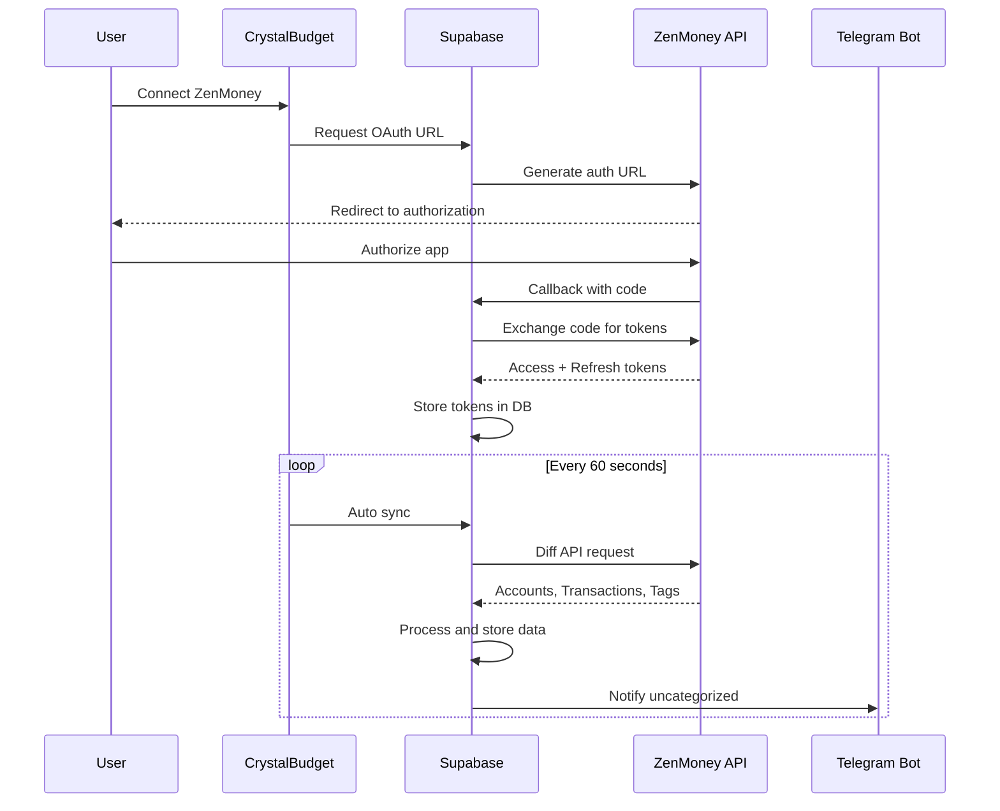

# ZenMoney Integration Setup Guide

This guide explains how to set up ZenMoney API integration with CrystalBudget.

## Overview

CrystalBudget supports full integration with ZenMoney's API using OAuth 2.0 authentication. This allows:

- ✅ Automatic synchronization of transactions, accounts, and categories
- ✅ AI-powered transaction categorization
- ✅ Telegram notifications for uncategorized transactions
- ✅ Multi-currency support
- ✅ Family account support

## Connection Methods

There are **two ways** to connect ZenMoney to CrystalBudget:

### Method 1: Manual Token (Easier, but less secure)

1. Get an access token from any OAuth-registered service (like Zerro.app)
2. Go to Settings → ZenMoney в CrystalBudget
3. Select "Zero App API" mode
4. Paste your access token
5. Click "Save Token"

**Pros:**
- No OAuth registration needed
- Quick setup

**Cons:**
- Tokens may expire
- Need to manually refresh tokens
- Less secure

### Method 2: OAuth 2.0 (Recommended)

Use ZenMoney's official OAuth flow for secure, automatic authentication.

**Pros:**
- Secure authentication
- Automatic token refresh
- Better user experience

**Cons:**
- Requires OAuth application registration
- More complex setup

## OAuth Setup (Method 2)

### Step 1: Register OAuth Application

1. Go to [ZenMoney OAuth Registration](https://zenmoney.ru/oauth/register/)
2. Fill in the registration form:
   - **Application Name**: CrystalBudget (or your preferred name)
   - **Description**: Personal finance management app
   - **OAuth Callback URL**: `https://YOUR_DOMAIN/settings` or your callback endpoint
   - **Website**: Your app URL (optional)

3. Submit the form and wait for approval
4. You will receive via email:
   - `consumer_key` (also called `client_id`)
   - `consumer_secret` (also called `client_secret`)

> **Note**: ZenMoney only approves real projects that comply with OAuth 2.0 protocol.

### Step 2: Configure Environment Variables

Add the following environment variables to your Supabase project:

```bash
# Go to Supabase Dashboard → Edge Functions → Secrets
ZENMONEY_CLIENT_ID=your_consumer_key_here
ZENMONEY_CLIENT_SECRET=your_consumer_secret_here
ZENMONEY_REDIRECT_URI=https://your-domain/settings
```

**How to add in Supabase:**

```bash
# Using Supabase CLI
supabase secrets set ZENMONEY_CLIENT_ID=your_consumer_key
supabase secrets set ZENMONEY_CLIENT_SECRET=your_consumer_secret
supabase secrets set ZENMONEY_REDIRECT_URI=https://your-domain/settings

# Or via Supabase Dashboard
# Dashboard → Edge Functions → Manage secrets → Add new secret
```

### Step 3: Deploy Edge Functions

```bash
cd /home/gena1/crystalbudget

# Deploy zenmoney-auth function
supabase functions deploy zenmoney-auth

# Deploy zenmoney-sync function
supabase functions deploy zenmoney-sync

# Deploy other ZenMoney-related functions
supabase functions deploy zenmoney-map-categories
supabase functions deploy zenmoney-balance-check  
supabase functions deploy zenmoney-reset-sync
```

### Step 4: Test OAuth Connection

1. Open CrystalBudget app
2. Go to **Settings → ZenMoney**
3. Select sync period (1 day, 7 days, 30 days, or All)
4. Click **"OAuth"** button
5. Click **" Подключить через OAuth"**
6. You'll be redirected to ZenMoney authorization page
7. Log in to ZenMoney and click "Allow"
8. You'll be redirected back to CrystalBudget
9. Connection status should show "✅ ZenMoney подключен"

## How It Works

### Synchronization Flow



### Data Mapping

| ZenMoney Entity | CrystalBudget Entity | Notes |
|----------------|---------------------|--------|
| Account | `zenmoney_accounts` | Stores balance, account type |
| Tag (showOutcome=true) | `categories` | Expense categories |
| Tag (showIncome=true) | `income_sources` | Income sources |
| Transaction (outcome>0) | `expenses` | Expenses |
| Transaction (income>0) | `incomes` | Income transactions |
| Merchant | Expense `description` | Payee field |

### Categorization Logic

When a transaction is imported:

1. **Check ZenMoney tag**: If transaction has a tag in ZenMoney, map to existing category
2. **AI Categorization**: Use GPT-4o-mini to suggest category based on:
   - Transaction description
   - Merchant/payee
   - Amount
   - Historical patterns
3. **Telegram Notification**: Send notification with:
   - Transaction details
   - Category buttons
   - AI recommendation (⭐ marked)
   - Ignore/Close options

## Sync Modes

### Sync Period Options

- **1 Day**: Sync only yesterday's transactions
- **7 Days**: Sync last week
- **30 Days**: Sync last month  
- **All**: Full history sync

### Sync Types

- **Full Sync** (`all`): Syncs accounts, categories, and transactions
- **Transactions Only** (`transactions`): Only syncs new transactions (faster)

Auto-sync uses "Transactions Only" mode every 60 seconds.

## Troubleshooting

### OAuth Not Working

1. **Check environment variables**:
   ```bash
   # Verify secrets are set
   supabase secrets list
   ```

2. **Check redirect URI**: Must match exactly what you registered
3. **Check Edge Function logs**:
   ```bash
   supabase functions logs zenmoney-auth --tail
   ```

### Sync Not Working

1. **Check connection status**: Settings → ZenMoney
2. **Check sync state**: Look at `zenmoney_sync_state` table
3. **Manual sync**: Click "Синхронизировать сейчас" button
4. **Check logs**:
   ```bash
   supabase functions logs zenmoney-sync --tail
   ```

### Token Expired

Tokens are automatically refreshed. If not:

1. Disconnect ZenMoney (Settings → ZenMoney → Отключить)
2. Reconnect using OAuth

### No Transactions Imported

1. **Check sync period**: Ensure you selected appropriate period
2. **Check date filter**: Transactions are filtered by `sync_days_limit`
3. **Check ZenMoney data**: Ensure transactions exist in ZenMoney

## API Reference

### ZenMoney API Documentation

- Official Docs: https://github.com/zenmoney/ZenPlugins/wiki/ZenMoney-API
- OAuth Protocol: OAuth 2.0
- Base URL: `https://api.zenmoney.ru/v8/`

### Edge Functions

- `zenmoney-auth`: OAuth authorization and token management
- `zenmoney-sync`: Diff API synchronization
- `zenmoney-map-categories`: AI-powered category mapping
- `zenmoney-balance-check`: Balance reconciliation
- `zenmoney-reset-sync`: Reset sync state

## Security Notes

- ✅ OAuth tokens are stored encrypted in database
- ✅ Row Level Security (RLS) enabled on all tables
- ✅ Each user can only access their own data
- ✅ Tokens are refreshed automatically before expiration
- ✅ HTTPS required for OAuth callback

## Support

If you encounter issues:

1. Check this guide first
2. Review Edge Function logs
3. Check database tables (`zenmoney_connections`, `zenmoney_sync_state`)
4. Open an issue on GitHub (if applicable)

---

**Last updated**: December 2, 2024
